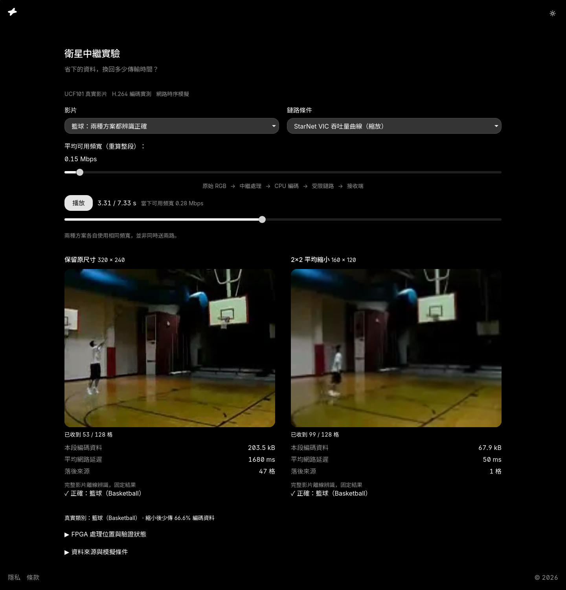

# Task Web

> Give a small web task a familiar home in Codex and Claude Code.

[](https://github.com/zyx1121/task-web/releases)
[](https://github.com/zyx1121/task-web/actions/workflows/check.yml)
[](LICENSE)

Personal tools and research demos should start with the task. This plugin supplies
Loki's four fixed corners and a focused working area, using the actual ui.zyx.tw
theme. It carries no book catalog, invoice workflow, sign-in or database.

- **Start** a clean React + Vite task with a source-only scaffold command.
- **Reuse** the shell in an existing React or Next.js project.
- **Discover** the same skill automatically in Codex and Claude Code.

[Live research example](https://dev.zyx.tw/semantic-gateway.html): real UCF101 clips
and measured encoded sizes, simulated network timing, fixed offline predictions.
It does not claim measured ZedBoard acceleration. Experiment data is separate from
this template repository.

## Install

```sh
# Codex
codex plugin marketplace add zyx1121/marketplace
codex plugin add task-web@zyx1121

# Claude Code
claude plugin marketplace add zyx1121/marketplace
claude plugin install task-web@zyx1121
```

Start a new conversation after installation. Ask naturally: "Build a personal web
tool to compare two experiments, using my zyx template." Explicit entry points
are `$task-web` in Codex and `/task-web:task-web` in Claude Code.

The skill is discoverable for personal tools, temporary interactive pages and
research demos. It preserves existing client designs and is not an always-on
instruction for every web task. No MCP server, hook or install-time build runs.

## Package boundaries

| Component | Responsibility |
|---|---|
| Task Web | Select the personal template, scaffold source and compose the four-corner shell. |
| [ui.zyx.tw](https://ui.zyx.tw) | Canonical theme and registry additions; stock shadcn base-nova supplies primitives. |
| [FDE](https://github.com/zyx1121/fde) | Operate an existing configured workspace, synchronize and snapshot it. |

Task Web and FDE can be used together or separately. The template contains
portable React compositions, not a snapshot of the dev.zyx.tw business pages.

## Use without an agent

With Node.js 22.12 or later:

```sh
node skills/task-web/scripts/create.mjs /path/to/new-task --title "My experiment" --lang en
```

The destination must be absent or empty. The command copies source, safely writes
metadata and refuses to overwrite existing work. On your development host:

```sh
cd /path/to/new-task
npm ci
npm run dev -- --host 127.0.0.1 --port 5173
```

Choose an isolated port on a shared host. Edit src/App.tsx for the task and
src/task.config.json for identity. npm run build creates static files. No hosting,
infrastructure, account or paid provider is configured for you.

## Design and integration

The shell provides the zyx mark, a task-action slot, shared legal links and
copyright. The center reserves space around the fixed corners. It supports light
and dark themes, keyboard navigation, responsive widths and locally served fonts.

The registry is copied at authoring time, not loaded at runtime. See the starter's
[design provenance](skills/task-web/assets/starter/DESIGN-SOURCE.md) for source
versions, fonts and its theme-refresh command. The current shadcn theme importer
has a parser incompatibility; the bundled serializer reads the same canonical
JSON without changing the stock primitives.

For an existing project, read the [integration guide](skills/task-web/references/integration.md).
Reuse its providers and shell before copying components. Do not scaffold over it.

## Contributing

Run npm run check for manifest generation and scaffolder tests. Create an isolated
app with the scaffold command, then run npm ci and npm run build there. CI performs
both checks. Keep the generated Claude manifest and starter lockfile committed.

Root plugin.json is the portable manifest; .claude-plugin/plugin.json is generated
compatibility metadata. Both hosts load skills/task-web/SKILL.md and its assets.
Release with SemVer, then pin the merged release commit in zyx1121/marketplace.

See the shared [contribution guidelines](https://github.com/zyx1121/.github/blob/main/CONTRIBUTING.md).

## License

[MIT](LICENSE). A small frame for the next useful thing.
Font licenses are included with their files or dependency packages.
